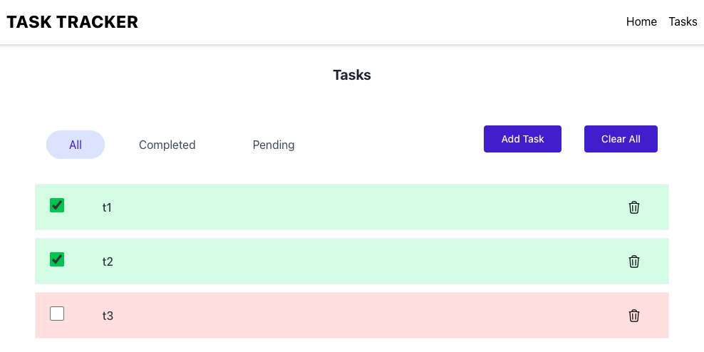
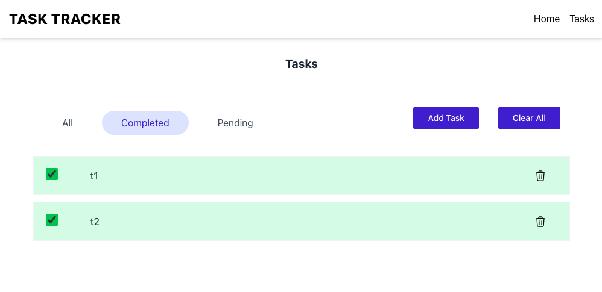
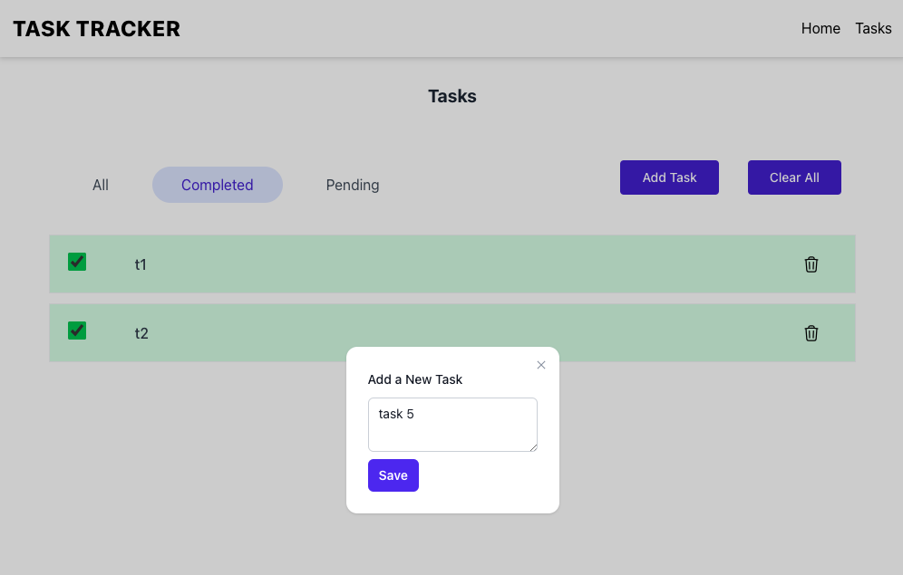
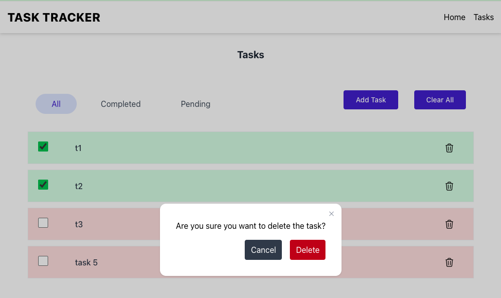

This is a task tracker application created using [Next.js](https://nextjs.org) project bootstrapped with [`create-next-app`](https://nextjs.org/docs/app/api-reference/cli/create-next-app) and TailwindCSS.

## Getting Started

To run the development server:

```bash
npm i
npmr run dev

```

Open [http://localhost:3000](http://localhost:3000) with your browser to see the result.


### Features implemented
- Nav bar showing Home and Tasks menu items
- Tasks page shows list of tasks from local storage or appropriate message when no tasks are available
- All, Completed, Pending filter to show filtered results
- Options to Add task, Clear/delete all tasks, delete a single task
- Use color coding to differentiate the tasks by completion status

### Screenshots
* All tasks


* Completed tasks


* Add new task


* Delete a task
